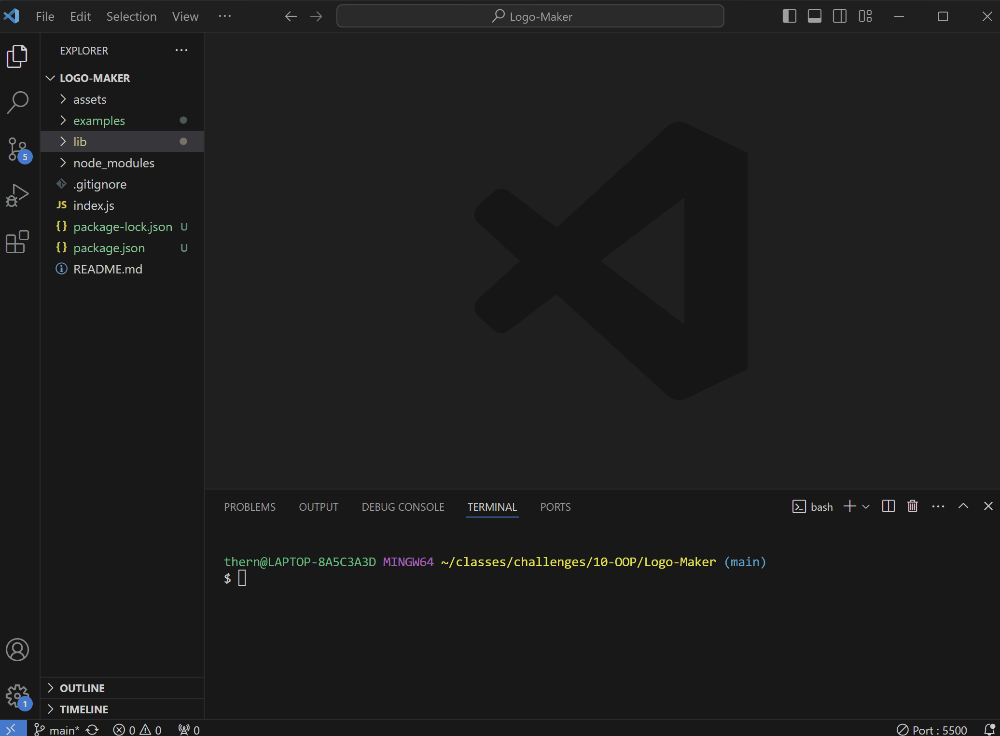
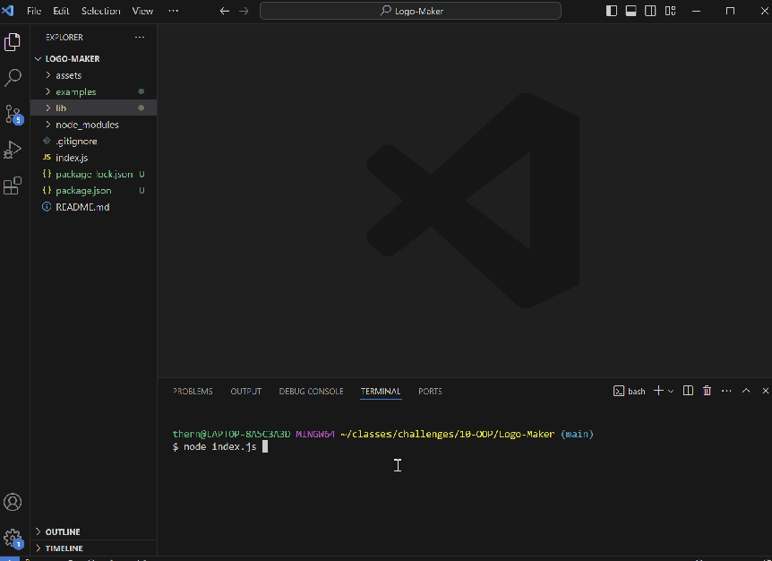
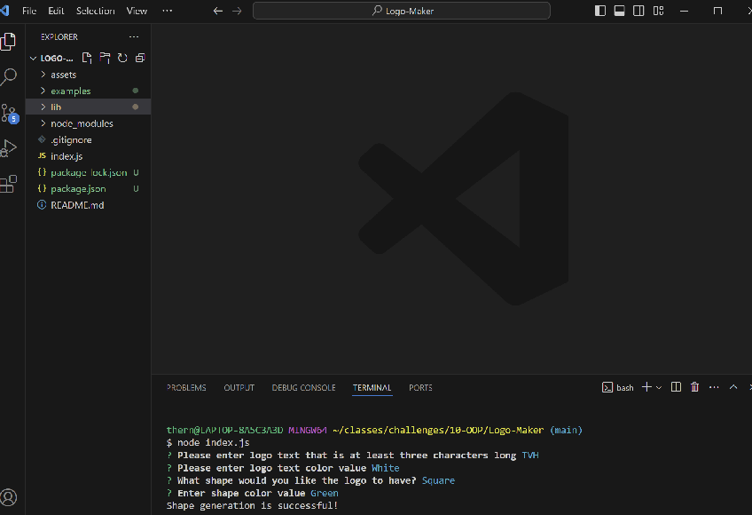
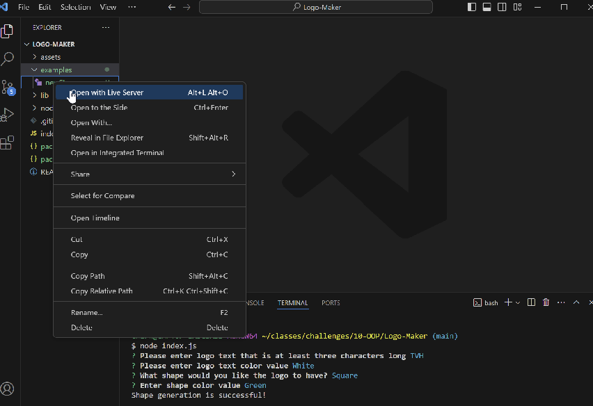
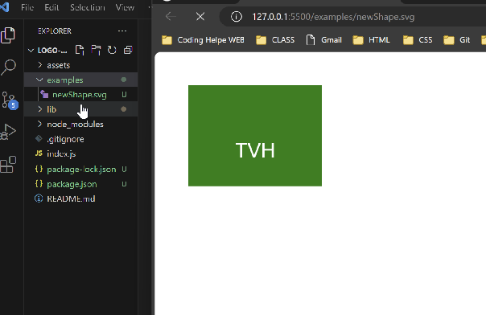

# Logo-Maker

## Table of Contents
* [User Story](#user-story)
* [Acceptance Criteria](#acceptance-criteria)
* [Usage](#usage)
* [Try Outs](#try-outs)
* [Screenshots](#screenshots)

### User Story

```md
AS a freelance web developer
I WANT to generate a simple logo for my projects
SO THAT I don't have to pay a graphic designer
```

## Acceptance Criteria

```md
GIVEN a command-line application that accepts user input
WHEN I am prompted for text
THEN I can enter up to three characters
WHEN I am prompted for the text color
THEN I can enter a color keyword (OR a hexadecimal number)
WHEN I am prompted for a shape
THEN I am presented with a list of shapes to choose from: circle, triangle, and square
WHEN I am prompted for the shape's color
THEN I can enter a color keyword (OR a hexadecimal number)
WHEN I have entered input for all the prompts
THEN an SVG file is created named `logo.svg`
AND the output text "Generated logo.svg" is printed in the command line
WHEN I open the `logo.svg` file in a browser
THEN I am shown a 300x200 pixel image that matches the criteria I entered
```
## Usage

GitHub Repo: (https://github.com/thernand09/Logo-Maker)

Video Link: (https://1drv.ms/i/c/5ca06fe9d3022510/EWL8zoTxNghImICAJ-4mBF4BSmvrLzmgY38FY0aW-xLSoQ?e=iWGiIN)

## DEMO




## Try Outs

User will need to first install Inquirer and Jest to application, once they have been installed question prompts will appear. User will answer qurestion prompts by using SVG the application will take answer prompts to create Logo. To open Logo Image User will go to 'Examples' folder and right click to open Live Server to view SVG image. 

## Screenshots
 
 
 
 